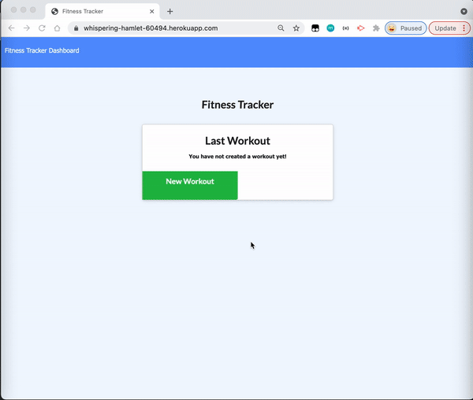
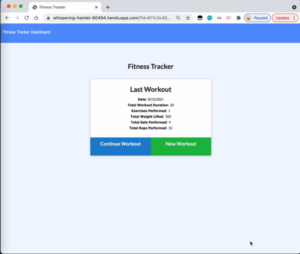

[](https://opensource.org/licenses/MIT)

# Workout Tracker

This project is to create a workout tracker for users to view, create and track daily workouts.

## Description

With the workout tracker, user can log multiple exercises in a workout on a given day. They could also be able to track the name, type, weight, sets, reps, and duration of exercise. If the exercise is a cardio exercise, they are able to track their distance traveled.

## Table of Contents
* [Installation](#installation)
* [Built With](#built-with)
* [Features](#features)
* [Deployed Page](#deployed-page)
* [Author](#author)
* [Questions](#questions)
* [Acknowledgments](#acknowledgments)

## Installation
```bash
git clone https://github.com/qtian13/workout-tracker.git
```

## Built With
* [JavaScript](https://www.javascript.com/)
* [NodeJS](https://nodejs.org/en/)
* [npm](https://www.npmjs.com/)
* [MongoDB](https://www.mongodb.com/)
* [mongoose](https://www.mongoose.com/)

## Features

* When the user load the page, they are given the option to create a new workout or continue with their last workout if there is any.
* User are able to add new exercises to a new workout plan

  
* User are able to Add exercises to the most recent workout plan.

  
* User are able to view the combined weight of multiple exercises from the past seven workouts on the dashboard.
* User are able to view the total duration of each workout from the past seven workouts on the dashboard.

  

## Deployed Page
The application is deployed on Heroku

Check the page: [https://whispering-hamlet-60494.herokuapp.com/](https://whispering-hamlet-60494.herokuapp.com/)

## Author
Qiushuang Tian
- [Link to Portfolio Site](https://qtian13.github.io/myPortfolio/)
- [Link to Github](https://github.com/qtian13)
- [Link to LinkedIn](https://www.linkedin.com/in/qiushuang-tian-a9754248/)

## Questions
Please reach me out with additional questions!

Emails: qiushuang.tian@gmail.com

## Acknowledgments
- [Berkeley Coding Boot Camp](https://bootcamp.berkeley.edu/coding/) provided mock up video and fontend code